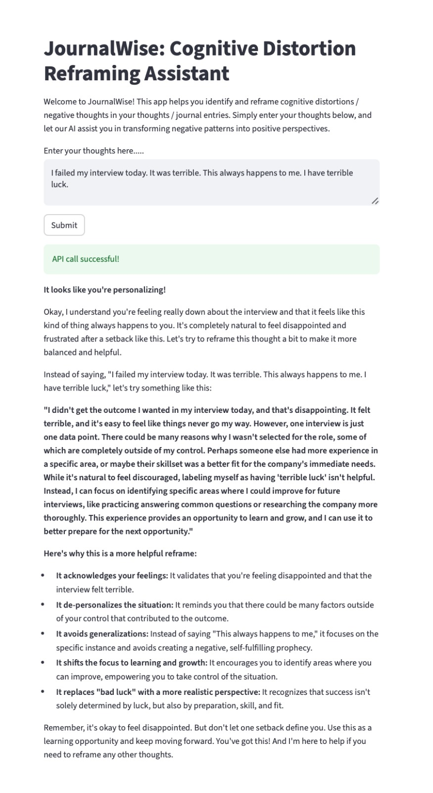

# JournalWise
Cognitive Distortion Detection in Journal Entries

JournalWise is a project that explores detecting cognitive distortions in user-generated text, such as journal entries. Cognitive distortions are recurring, biased ways of thinking that can reinforce negative thoughts, emotions, and behaviors.

By combining NLP preprocessing, data augmentation, and machine learning models, this notebook builds a model to classify distorted thinking patterns. I have also deployed the model with FastAPI and created a UI with streamlit.

## 🧠 Cognitive Distortions
Cognitive distortions are irrational thought patterns that alter how people perceive themselves, others, or the world. They can fuel stress, anxiety, and depression by making situations seem worse or more negative than they really are.

### 🏷️ Cognitive Distortion Classes

This project classifies journal entries into one of the following five distortion types, or none if no distortion applies.

1. Catastrophizing

    When individuals imagine the worst possible outcome, even if it’s highly unlikely. \
    ➡️ “If I forget one detail in my presentation, my whole career will be ruined.”

2. Overgeneralization

    Drawing broad, sweeping conclusions based on limited evidence. \
    ➡️ “One person ignored me; therefore, nobody likes me.”

3. Mind Reading

    Assuming you know what others are thinking or feeling, without concrete evidence. \
    ➡️ “She didn’t text back, so she must be angry at me.”

4. Personalization

    Blaming yourself (or unfairly blaming someone else) for events outside of personal control. \
    ➡️ “My team lost because I didn’t work hard enough.”

5. Emotional Reasoning

    Believing that because you feel something, it must automatically be true. \
    ➡️ “I feel like a failure, so I must be one.”

6. None

    If a journal entry does not fit into any of the above categories, the model returns:
    ➡️ none

## 🚀 Full Stack ML pipeline
1. Scrapes text data related to mental health / journal entries from Reddit using the RedditAPI
2. Labels text data using rule based methods and LLMs
3. Preprocesses and cleans text data using NLTK
4. Performs exploratory data analysis (EDA)
5. Implements a baseline Logistic Regression Moddel model to classify cognitive distortions
6. Handles data imbalance with data augmentation techniques using nlpaug
7. Implements SVM model to classify cognitive distortions 
8. Deploys ML model with FastAPI and UI is built with Streamlit
9. Uses Gemini API to reframe thoughts positively

## 🖼️ Project Screenshot

